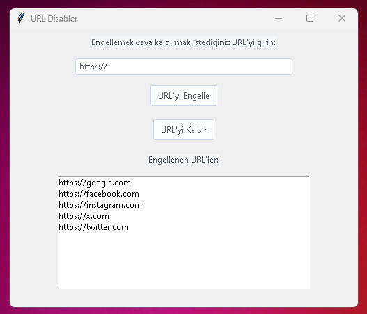
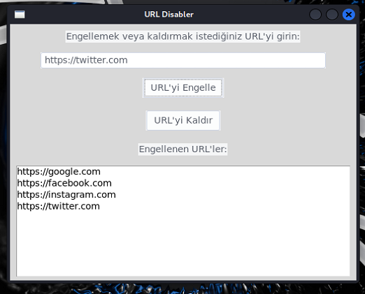

<a href="#">
    
</a>

# url_disabler
GUI URL Blocking Application written in Python language. Cross Platform Interoperable URL Blocking and Unblocking

Install Git Clone and Python3

Github Package Must Be Installed On Your Device.
```bash
sudo apt install git -y
```
Python
```bash
sudo apt install python3 -y
```
----------Required Libraries----------

Tkinter
```bash
sudo apt-get install python3-tk
```

ttkthemes
```bash
pip install ttkthemes
```

----------------------------------
https://fatihonder.org.tr/python-ile-url-disabler-url-engelleyici-uygulamasi/

# Installation
Install url_disabler


```bash
sudo git clone https://github.com/cektor/url_disabler.git
```
```bash
cd url_disabler
```

```bash
python url.py
```
or

```bash
python3 url.py

```

# To compile

NOTE: For Compilation Process pyinstaller must be installed. To Install If Not Installed.

pip install pyinstaller 

Linux Terminal 
```bash
pyinstaller --onefile --windowed url.py
```

Windows VSCode Terminal 
```bash
pyinstaller --onefile --noconsole url.py
```

MacOS VSCode Terminal 
```bash
pyinstaller --onefile --noconsole url.py
```

# To run directly on Windows or Linux
Download and Run According to Your Operating System from the Link

https://github.com/cektor/url_disabler/releases/tag/1.0


# Windows Screenshot

 

# Linux Screenshot

 
